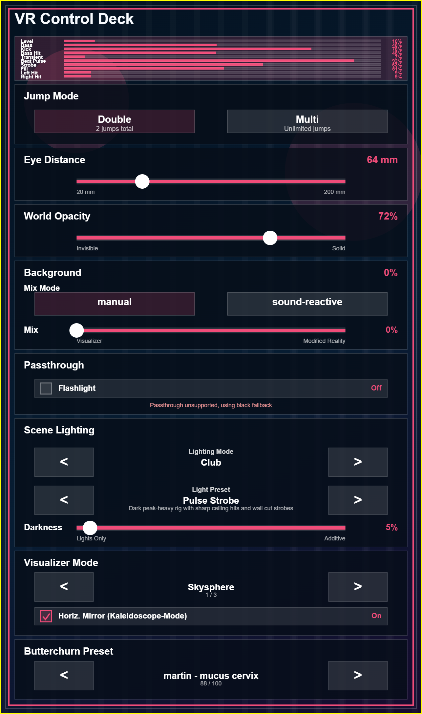

# WebXR Visualizer

Audio-reactive WebXR visualizer built with plain HTML and vanilla JavaScript — Butterchurn-driven visuals, passthrough AR, shared scene lighting, and a full in-headset menu. No build step, no frameworks.

**[Live Demo](https://phobi82.github.io/webxr_butterchurn/)**

## Disclaimer

> [!WARNING]
> ### Photosensitivity / Epilepsy Warning
> This project contains flashing lights, rapid visual changes, and intense motion that may trigger seizures or cause discomfort in people with photosensitive epilepsy or related conditions.
>
> Please use caution and stop immediately if you experience any discomfort.

> [!CAUTION]
> ### Motion Sickness Warning
> This project may cause motion sickness, dizziness, nausea, and disorientation, especially in VR.
>
> It intentionally includes no comfort features whatsoever.  
> No teleport. No tunnel vision. No training wheels.  
> The experience is designed to be intense, because VR should sometimes feel a little overwhelming.
>
> Proceed at your own risk - and maybe not right after lunch.

## Features

### Visualizer

- Three visualizer modes: **Toroidal**, **Skysphere**, **Sky Toroid** with optional horizontal mirroring
- Butterchurn preset engine starts immediately on page load
- Audio-reactive floor colors and shared scene lighting

### Audio Sources

| Source | Description |
|---|---|
| **Select Audio-Source** | Capture audio from a shared display, window, or tab |
| **Use Microphone** | Capture microphone input |
| **Debug Audio** | Synthetic tone generator for visualizer and lighting debugging |
| **YT Synth** | Opens a synth-oriented YouTube playlist and expects tab-audio sharing |
| **YT House/Disco** | Opens a house/disco YouTube playlist and expects tab-audio sharing |
| **Suno Live Radio** | Opens Suno Live Radio and expects tab-audio sharing |

### Passthrough & Depth

- **Flashlight**: controller-driven circular passthrough cutouts with radius and softness controls
- **Distance**: near-depth cutout mode — geometry closer than a configurable distance opens toward passthrough, with optional sound-reactive modulation
- **Echo**: repeating depth bands alternating between passthrough and modified reality, with phase animation, wavelength, duty cycle, and selective sound-reactivity
- **Direct Depth + Reprojection**: shared raw-depth path with no smoothing or reconstruction, using one canonical 2D depth surface so passthrough punch, world masking, and depth-aware lighting all consume the same direct depth plus spatial reprojection
- **Spatial Depth Masking**: depth masks are reprojected from the source depth pose into the current render view so headset reprojection can act on them spatially, without exposing a manual timing offset or legacy motion-compensation mode
- **Lighting Anchoring**: `Auto`, `VR World`, and `Real World` anchor modes for passthrough lighting placement, with `Auto` preferring real-world adhesion when usable depth is present and falling back to VR-world anchoring otherwise
- **Depth-bound Light Projection**: passthrough lighting now reuses the shared canonical 2D depth surface directly inside the overlay renderer when available, and falls back to the hypothetical room shell when depth is unavailable
- **Shared Light Layers**: fixture effects now build one reusable `lightLayers` frame buffer that projection and passthrough share directly, instead of repacking per-frame object lists into renderer-specific arrays
- Background mix crossfades between visualizer and darkened modified reality via **manual** or **sound-reactive** blend modes

### Scene Lighting

- Lighting modes: **None**, **Uniform**, **Spots**, **Club** (preset- and audio-driven)
- Lighting presets: `Aurora Drift`, `Disco Storm`, `Neon Wash`, `Stereo Chase`, `Pulse Strobe`
- Optional WebXR depth sensing for depth-aware light placement in immersive AR
- Shared fixture groups drive both passthrough lighting and VR-world scene lighting so color and timing stay synchronized
- Wall-bound fixture effects keep their authored `vertical` placement in the fallback room, so silhouettes, beats, and runners stay on believable wall tracks

### XR Session

- Prefers `immersive-ar` with `local-floor`, falls back to `immersive-vr`
- WebXR rendering via `XRWebGLLayer`, with `XRWebGLBinding` used for depth queries when available
- Desktop preview with shared locomotion: walking, jumping, sprinting, crouching, tiptoe, airborne boost
- Collision world with platforms, structures, and GLB props
- In-headset menu plus mirrored desktop preview using the same menu system

## Visualizer Modes

| Mode | Mapping | Roll | Poles | Description |
|---|---|---|---|---|
| **Toroidal** | Screen-space UV + head yaw/pitch offset | Rotates with head roll | None | Flat fullscreen quad with toroidal texture wrapping driven by head orientation. Fastest and simplest mode. The `Mirror Horizontal` checkbox can replace the normal horizontal wrap with mirrored repetition. |
| **Skysphere** | 3D raycasting via view matrix to spherical coordinates with fixed `4x` horizontal wrap | Stable | Convergence at poles | Computes world-space view direction per pixel, converts to yaw/pitch, and closes the full `360` degrees with a fixed four-repeat wrap. The mode also derives its own source-canvas width from the current target height and vertical FOV so the calibrated horizontal wrap stays visually proportionate. The `Mirror Horizontal` checkbox swaps the horizontal wrap for mirrored segments. |
| **Sky Toroid** | View-space angular offsets with roll correction + head yaw/pitch | Stable | None | Computes per-pixel angular offsets in view space, counter-rotates by the camera roll, then adds world-space head orientation. Combines the roll stability of Skysphere with the pole-free tiling of Toroidal. The `Mirror Horizontal` checkbox swaps its horizontal wrap for mirrored repetition. |

## Controls

### Desktop

| Input | Action |
|---|---|
| Click view | Request pointer lock |
| Mouse | Look around |
| Left mouse button | Sprint while held |
| Right mouse button | Crouch while held |
| `W` `A` `S` `D` | Move |
| `Space` | Jump |
| `M` | Show / hide mirrored menu preview |

### VR

| Input | Action |
|---|---|
| Left stick | Move |
| Left trigger | Sprint |
| Right stick X | Turn |
| Right stick Y | Persistent crouch / temporary tiptoe |
| `A` (right controller) | Jump (hold briefly for extra height) |
| Right trigger (airborne) | Directional air boost |
| `Y` (left) or `B` (right) | Open / close in-headset menu |
| Trigger on menu | Press buttons, drag sliders |
| In-headset menu | `Exit VR` to end session |

## In-Headset Menu



The menu exposes these sections:

- **Jump Mode**: Double, Multi
- **Eye Distance** and **World Opacity** sliders
- **Background**: manual or sound-reactive mix mode with blend control
- **Passthrough**: Flashlight toggle and depth modes (Distance, Echo)
- **Scene Lighting**: lighting mode, light preset, anchor mode, darkness control
- **Visualizer Mode** selector with horizontal mirror toggle
- **Butterchurn Preset** selector
- **Session**: Exit VR button
- **Audio Meters**: Level, Bass, Kick, Bass Hit, Transient, Beat Pulse, Strobe, Fill, Left Hit, Right Hit

The main control deck is laid out in multiple numbered columns: audio meters run across the full top row, `Background` now sits in the left stack directly under `World Opacity`, `Passthrough` and `Scene Lighting` occupy the second column, and `Exit VR` is reserved for the footer at the bottom. The menu texture is wider than the original single-column version, while the in-headset plane stays smaller than a literal 2x expansion.

## Requirements

| Requirement | Enables |
|---|---|
| Modern browser with WebGL | Desktop preview |
| WebXR-capable browser/runtime | Immersive VR/AR sessions |
| Passthrough-capable headset | Real environment in AR instead of black fallback |
| Depth-sensing AR support | Depth-aware passthrough lighting and punch controls |
| Microphone or screen/tab-capture permission | Live audio-reactive visuals |
| Popup permission | Auto-opening YT Synth, YT House/Disco, Suno Live Radio tabs |

## Run Locally

There is no build step and no backend.
Repository text files use `LF` line endings by policy; `.gitattributes` and `.editorconfig` keep that stable across editors on Windows, macOS, and Linux.

1. Clone or download the repository.
2. Open [`index.html`](./index.html) in a modern browser.
3. Wait for the XR status line to report readiness.
4. Use the desktop shell to test audio input, menu options, and preview movement.
5. Enter immersive mode when the browser and headset report support.

## Effect Test Lab

Open [`TestLab.html`](./TestLab.html) to inspect one lighting effect at a time instead of full presets. The test lab starts with neutral passthrough settings (Uniform, Manual, Mix 100%) so the active effect stays easy to judge in isolation. It uses the same runtime modules as `index.html` with a reduced in-headset menu focused on effect parameters.

<details>
<summary><strong>Quest Development Setup</strong></summary>

### Local HTTPS for Quest

Use `start-local-https-server.bat` to start a small HTTPS static server on port `8443`. It uses helper files from `local-dev-https/` and generates a local self-signed certificate when needed. Open the printed `https://...:8443/` URL from the Quest on the same LAN.

### Quest Debugging Over Wi-Fi

For longer debugging sessions, switch `adb` from USB to Wi-Fi:

Run `switch-quest-adb-to-wifi.bat` from the repo root to execute the full sequence automatically. The script auto-detects one USB-connected Quest even when other `adb` targets are present, reports if a Quest is already connected over Wi-Fi without USB, and stops if multiple Quest headsets are connected over USB at the same time.

1. Connect the Quest once over USB and confirm USB debugging on the headset.
2. Run `adb tcpip 5555`.
3. Read the Quest Wi-Fi address: `adb shell ip addr show wlan0`.
4. Connect over Wi-Fi: `adb connect <quest-ip>:5555`.
5. Verify with `adb devices`, then unplug USB.

For Quest Browser remote debugging:

```
adb forward tcp:9222 localabstract:chrome_devtools_remote
```

Then open `http://127.0.0.1:9222/json/list`. Page targets can change after reloads, so refresh the list before reattaching. Remote `Enter VR` usually still requires a real headset-side user gesture.

</details>

<details>
<summary><strong>Project Structure</strong></summary>

| File | Purpose |
|---|---|
| `index.html` | Browser entry point, desktop shell, buttons, status labels, canvas |
| `TestLab.html` | Isolated single-effect lighting test page |
| `xr-shared.js` | Shared math, DOM, and GL utilities |
| `xr-audio.js` | Audio capture, analyser pipeline, stereo metrics, debug synth |
| `xr-lighting.js` | Lighting presets, fixture effects, scene-lighting state, and MR light-layer projection |
| `xr-passthrough.js` | Passthrough modes, passthrough controller, and overlay-state policy |
| `xr-depth.js` | Canonical depth adapter that normalizes runtime depth sources into one shared 2D raw-depth surface |
| `xr-menu.js` | Menu sections, menu view, menu controller, and TestLab menu config |
| `xr-movement.js` | Collision world and locomotion |
| `xr-render.js` | GLB asset loading, scene geometry, MR lighting renderer, and scene renderer |
| `xr-visualizer.js` | Visualizer engine and visualizer mode catalog |
| `xr-runtime.js` | Desktop input, XR session bridge, runtime loop, and frame orchestration |
| `xr-app.js` | App shell normalization and shared app composition |

</details>

## GitHub Pages

Deployed via `.github/workflows/deploy-pages.yml` on pushes to `main`.

## Acknowledgements

Parts of this project are derived from or based on Butterchurn, and this repository also bundles Butterchurn preset data.

- https://github.com/jberg/butterchurn
- https://github.com/jberg/butterchurn-presets

## License

This repository is licensed under the [MIT License](./LICENSE).

Bundled third-party components:

- `butterchurn.min.js` is derived from or based on `jberg/butterchurn` and is covered by the MIT License
- `butterchurnPresets.min.js` is derived from or based on `jberg/butterchurn-presets`, which is published on GitHub as MIT-licensed
- bundled third-party licensing details are collected in [THIRD_PARTY_LICENSES.md](./THIRD_PARTY_LICENSES.md)

If you redistribute or modify the bundled Butterchurn files, keep the upstream copyright and permission notices with them and verify the current upstream license files during release review:

- https://github.com/jberg/butterchurn
- https://github.com/jberg/butterchurn-presets

## Changelog

Project history is tracked in [`CHANGELOG.md`](./CHANGELOG.md).
